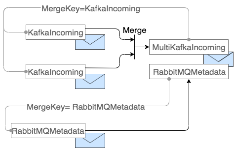

[](https://github.com/AmadeusITGroup/odyssey-reactive-messaging/actions)
[](https://opensource.org/licenses/Apache-2.0)

# Explorations for the MicroProfile Reactive Messaging specification

### Reactive Messaging for MicroProfile exploration

This project is about experimenting with new ideas for the [Reactive Messaging for MicroProfile](https://github.com/eclipse/microprofile-reactive-messaging) specifications.

The current main focus is on the follow aspects:
 
* Messages lifecycle (creation, child messages, ...).

* Message acknowledgment.

* Dependency injection integration, noticeably in regard of reactive streams.

All of the code of this project is a *prototype*. Some pieces of it are advanced, others are not.

Even the prototyped new APIs are not fully polished so far and are likely to benefit from iterations.

### Expected benefits

The main expected benefits of this project are:

* Enabling messages forks and joins in the reactive flow.

* Understanding how dependency injection and reactive streams could play together, specifically with the
challenge of threads (i.e. In CDI, a *NormalScope* is thread bound.).

* Understanding how, if possible, this could be implemented at least with CDI, and also with Quarkus DI.

* To be used as a basis (API and implementation wise) of discussion for integration into the [Reactive Messaging for MicroProfile](https://github.com/eclipse/microprofile-reactive-messaging) specifications..

### References

* [Reactive Messaging for MicroProfile](https://github.com/eclipse/microprofile-reactive-messaging)

* [smallrye-reactive-messaging](https://github.com/smallrye/smallrye-reactive-messaging)

## Prototyped API

This section introduces some basic elements.
Additional concepts are introduced in the following sections with more advanced scenario.

### Message

A `Message` is exposed as an interface, however *it is only implemented by the framework*.
There is no sub-classing by connector providers.

A `Message`, along with all what is contained inside it, is a simlpe POJO and can go through reactive streams without any concern.
It can be injected into beans, however it cannot itself have injected fields or method parameters.

Here is the basic API:

```java
public interface Message<T> {
  Iterable<MessageContext> getContexts();
  <C extends MessageContext> C getMessageContext(String key);
  void addContext(MessageContext ctx);
  T getPayload();
  void setPayload(T payload);
  ...
}
```

### Payload

As with the MP-RM v1.0, the Message is parameterized by the payload type.
A payload is mutable.

### MessageContext

`MessageContext` is a new addition to the `Message`.
It enables to provide contextualized meta-data to it.
As part of the `Message` it is a POJO.

This contextualization can be provided by the source connector.
For instance a Kafka connector, will provide a `KafkaContext` with Kafka specific pieces of information, e.g.:

```java
@MessageScoped
public interface KafkaContext extends MessageContext {
  String KEY = "MY_KAFKA_IMPLEMENTATION";

  String topic();
  int partition();
  long offset();
  long timestamp();
  TimestampType timestampType();
}
```

Beyond the source connector, a corporate framework can also provide `MessageContext(s)` to enrich the message just after it creation, e.g.:

```java
@MessageScoped
public interface EventContext extends MessageContext {
  String getUniqueMessageId();
}
```

### Message processing

As with the MP-RM v1.0, a processor can be implemented using the `@Incoming` and `@Outgoing` annotations with the 
following signature:

```java
  @Incoming("input_channel")
  @Outgoing("business_internal_channel1")
  public void stage1(String payload) {
    ...
  }

  @Incoming("business_internal_channel1")
  @Outgoing("business_internal_channel2")
  public void stage2(Message<String> message) {
    ...
  }
```

What is added to the API is:

The injection of `MessageContext` in method call:

```java
  @Incoming("internal_channel")
  @Outgoing("output_channel")
  public void example(KafkaContext kafkaContext, EventContext eventContext, Message<String> message)
    ...
  }
```

The injection of what can be injected into the method call using regular DI mechanism
(except the payload, while it might be added):

```java
  @Inject
  private KafkaContext kafkaContext;

  @Inject
  private EventContext eventContext;

  @Inject
  private Message<String> message;

  @Incoming("internal_channel")
  @Outgoing("output_channel")
  public void example() {
    ...
  }
```

The two previous examples are equivalents from user perspective.

### End-user API for reactive stream

In the previous example, the injected objects are bound to the execution thread, hence they can't be directly used inside
a reactive stream, nor in any asynchronous mechanism.

To do so, the developer has to get a direct reference to the POJO instead of its proxied (thread-bound) instance.
This is achieved thanks to the introduction of a new type `Async` belonging to the MP-RM framework.
This `Async` type is parameterized with the type of instance that is expected, e.g.:

```java
  @Inject
  private Message<String> message;

  @Inject
  private Async<Message<String>> asyncMessage;

  @Incoming("internal_channel")
  @Outgoing("output_channel")
  public void example() {
    Message<String> pojoMessage = asyncMessage.get(); // non-proxied instance of the message
    ...
  }
```

The `pojoMessage` instance can be sent to any asynchronous processing here.

It is worth noting that the `message` injected proxy is referencing the POJO object obtained in `pojoMessage`.
In another words, for instance, updating the payload in one or the other is equivalent.

### Compliance with the Emitter API

*This part has not been prototyped so far*

The current `Emitter<T>` API has two `send` methods, one for payload the other one for `Message`:

```java
public interface Emitter<T> {

  CompletionStage<Void> send(T msg);

  <M extends Message<? extends T>> void send(M msg);
 
  ...
}
```

It is proposed to change it only send `Message`:

```java
public interface Emitter<T> {
  void send(Message<T> msg); 
  ...
}
```

Using `Emitter` will fit the regular case as any DI enabled Message will flow.

See below for `Message(s)` and their child lifecycle.

### Message lifecycle

Let's dig into more details, and focus on the lifecycle of `Message(s)`.

#### Creation

*One example can be found in the module `kafka-connector-provider`*

A `Message` can be built only by using the framework API.
A source connector can provide it own `MessageContext` at this time, e.g.:

```java
    KafkaConsumer<String, String> consumer = KafkaConsumer.create(vertx, config);
    ... 

    return consumer.toFlowable()
        .map(record -> Message.builder()
            .addMessageContext(new KafkaContext(record))
            .payload(record.value())
            .build());
```

Here the `MessageBuilder.build()` method call returns the POJO that is send into the reactive stream.

As the `Message` is built by the framework, any needed CDI-related initialization can be performed at this time.

Note: The builder is also exposing a 'dependencyInjection(boolean activate)' method that is enabling the override the
default value for CDI activation (...).
This is to enable higher performances for highly constrained implementations (e.g. for a technical gateway).

#### Acknowledgement & CDI context destruction

As a context has to be created for each `Message` when CDI is activated, it has to be deleted at some stage.
This deletion is handled by the CDI implementation of the framework upon message global acknowledgement.

Note: This context is not necessarily a CDI `Context` (...).

#### Adding a `MessageContext` to the message just after it has been built

*One example can be found in the module `corporate-framework`*

It is possible to enrich the `Message` with additional `MessageContext(s)` when the message is built.
To do so, the `MessageBuilder` will call method(s) annotated with `@MessageInitializer` in a bean.

The method will then be able to customize the message and, if needed, get access to other `MessageContext` as the
bean can be injected.
The injected `MessageContext` should be the one initially given to the builder to prevent issue with creation order.

```java
public class EventContextMessageInitializer {

  @Inject
  private KafkaContext kafkaContext;

  @Inject
  private Message<?> message;

  @MessageInitializer
  public void initialize(KafkaContext direcKafkaContext) {
    EventContext ec = new EventContextImpl();
    ec.setEventKey((String) kafkaContext.key());
    message.addContext(ec);

    String payload = (String) message.getPayload();
    ec.setUniqueMessageId(payload.split("-")[0]);
  }
}
```

Note: Some additional logic could be added to handle creation order.

### From one to n Messages

#### Message child semantic

Let's assume that a processor is sending several messages built from a single one.
This can either be achieved by using `Emitter` or by returning a `Publisher<Message>`, or even by a of mix of both.

Let's assume that from, a message `m0`, the processor is sending (`m1`, `m1'`).

```java
                     |-- m1
m0 --> processor --> |
                     |-- m1'
```


The naturally expected semantic for theses messages is to be children of `m0`:

* Often, the payload is not expected to be shared (while it can be in some cases).

* Some `MessageContext` might be propagated, other not, e.g.: the `KafkaContext`.
Some other `MessageContext` can be built from the previous one (e.g. for OpenTracing span creation
using [SpanBuilder.asChildOf](https://github.com/opentracing/opentracing-java/blob/master/opentracing-api/src/main/java/io/opentracing/Tracer.java#L144)).

* Regarding CDI, each new message should have its own specific context.

Here is a first example of how a child message `m1` could be created from `m0` and propagated:

```java
  Emitter<Message<String>> way1;
  ...
      { ...
      // Build a derived EventContext:
      // * The EventContext could contain OpenTracing id and it is wanted to created a following span.
      // * The EventContext provider would have to also provide this builder.
      EventContext m1ec = EventContext.build(m0.getContext(EventContext.KEY)).build();
      
      // Create m1 with the same KafkaContext and the derived EventContext
      Message<String> m1 = Message.builder()
        .fromParent(m0)
        .context(m1ec)
        .payload("processed: " + m0.getPayload())
        .build();
    
      way1.send(m1);
      ...}
```

However, for creating a child `Message` with a new payload a *one-liner* would be nicer.
To do so, let's introduce the following concepts:

A `MessageContext` is regarded as immutable.
A `MutableMessageContext` is a sub-interface of `MessageContext` for mutable `MessageContext` and expose a method `createChild()`.
A child-`Message` will the be able to use its parent `MessageContext` instance, except when mutable where a child-`MessageContext` will be created.
Hence, the previous code can be re-written as:

```java
  Emitter<Message<String>> way1;
  ...
      { ...    
      Message<String> m1 = Message.builder()
        .fromParent(m0)
        .payload("processed: " + m0.getPayload())
        .build();
    
      way1.send(m1);
      ... }
```

The `MessageBuilder` will automatically propagate the `MessageContext` into the child-`Message` following this logic.

#### Message acknowledgment

##### Concrete example

Let's introduce an example of a micro-service to make it more concrete:


Here are the steps:

1. An incoming message is entering a source connector.

2. The source connector is converting it into a Reactive Messaging `Message` (`m0`) and publishing it into a channel
of the reactive stream.

3 & 3': The business processor has created two messages (`m1` and `m1'`) and sent them towards different channels.
The flows for `m1` and `m1'` are not synchronized as they go through two dissociated branches of the reactive stream.

4 & 4': The sink connectors have transformed their input message into technology specific messages and sent them to their
destination.

5 & 5': The destinations are acknowledging their messages.

6: The connector acknowledges the incoming `m1` message.

7: The message `m1` signal towards `m0` that it has been acknowledged.
However, at this stage, `m0` is not acknowledged as it is waiting the acknowledgment from `m1'`.

6': The connector acknowledges the incoming `m1'` message.

7: The message `m1'` signal towards `m0` that it has been acknowledged.
As, now, both `m1` AND `m1'` are acknowledged, `m0` is also acknowledged.

8: As the source connector was waiting asynchronously the acknowledgement of the message it has produced,
it is now triggered and:

9: The source connector acknowledges its own source.

#### Basic acknowledgement concepts

Hence, the incoming `m0` should be acked only when the outgoing `m1`,`m1'` are acked.

Let's start with a drawing exhibiting the acknowledgment logic for a parent `m0` message with a unique child `m1` both still
flowing into reactive streams:


Note 1: message.isAcked(), here, means: Is the message *globally* acked at *root* level (e.g. from the source connector perspective).

Note 2. `m0.stagedAcked()` means `m0` is acked at this stage of the process.
However, this doesn't mean that the message is "globally" acked (see below).

Let us introduce these acknowledgement concepts:

* *Message acknowledgement*: The message is *globally* regarded as acknowledged.

* *Message staged-acknowledgement*: At each stage of the processing a message can be acknowledged.
This acknowledgement can be chained with other ones using `CompletableFuture` that can also depends on other
completion conditions (for instance, created with `CompletableFuture.allOf`).
The staged level acknowledgement are creating a chain towards the `Message` acknowledgment.

#### Implementation with `CompletableFutures`

Let us represent two stages with their `CompletableFuture` materializing the acknowledgement state of the message:


In stage n:

* There is a completion link between the `CompletableFuture` associated to the current stage and the message global
acknowledgement `CompletableFuture`.

* Then, the completion of the stage will directly propagate towards the global message completion
(while not necessary completing it).

In stage n+1:

* A new current stage `CompletableFuture` has been created.

* A new anonymous `CompletableFuture` has been created using `CompletableFuture.allOf` from the current stage `CompletableFuture` and another `CompletableFuture` `X`.

* This `X` `CompletableFuture` can be used, for instance, to handle the completion of a database command, a Rest call,
the acknowledge of a message send to an external broker (...).

* When the anonymous `CompletableFuture` will complete this will propagate towards the global message completion.
As described for stage n, this might not necessarily globally acknowledge the message as previous stages might also
have create such kind of additional `X` conditions that might not be completed.

#### Acknowledgement with parent-child relationship

Now let us dig into the completion logic for a parent-child relationship:


Starting with two messages `m0` and `m1`, let's make `m0` the parent of `m1`:

The current acknowledgment stage of the `Message` `m0` should be replaced by a new one `stagedAck(m0).1` that will 
propagate the acknowledgement towards `messageAck(m0)` only when:

* It is, it-self, completed;

* AND, the `Message` `m1` is also acknowledged. 

Note: See `AbstractMessageBuilder.setupParentChildLink(List<Message<?>> parents, Message child)` and its U.T.

Now, let us consider a "pathological" cases:

* (`m1`, `m1'`) are actually the same `m0` that is re-sent several times.

If so, it is likely that one of these propagation of `m0` will be acked first which will destroy the CDI context.
Hence, if this CDI context should be started afterward, an exception will be raised from inside the stream  (...).

### From n to 1 (or more...) Messages

Let's considere the case where a *business processor* will issue one output message from a several input ones.
This can be seen as a *join* case.

Let's considere we have two different source connectors:


The *business processor* will issue the message `mC` from `mA` and `mB` with the following strategy:

* For each type of `MessageContext`, a new `MessageContext` should be associate to `mC` that has been built from the
merge of the instances of the same type coming from `mA` and `mB`.
The merge strategy is typically to be provided by the `MessageContext` provider.

* The payload of `mC` has to be provided by the business developer.

* The `mC` message global acknowledgement is mandatory for the staged acknowledged of `mA` and `mB`.

A concrete `MessageContext` type can either support naturally this merge, or not.
Let's considere a Kafka `MessageContext`.
It may indicate the source Kafka topic from where the message is coming but, in case of a merge,
it might not have the capability to indicate the list of the several source topics:

```java
public interface KafkaContext extends MessageContext {
  ...
  String topic();
  ...
}
```

To achieve this, a new kind of Kafka `MessageContext` supporting multiple sources might be introduced:

```java
public interface MultiKafkaContext extends MutableMessageContext {
  ...
  List<KafkaContext> getContexts();
  ...
}
```

Ideally, from user perspective, when it is known that there is a single origin it would be wanted to deal with `KafkaContext`
and, when it's not the case, `MultiKafkaContext` would be used.
Hence, in our example, messages A and B would have a `KafkaContext` and message C would have a `MultiKafkaContext`.
This means, the `MessageContext` provide should expose the capability to merge `KafkaContext(s)` and `MultiKafkaContext(s)` towards a `MultiKafkaContext`.

To achieve this, `MessageContext` exposes the following method that is to be called by the framework when a *child* message is created:

```java
public interface MessageContext {
  ...
  MessageContext merge(MessageContext... messageContexts);
  ...
}
```

This method will be called to merge compatible `MessageContexts`.
For instance, a `KafkaContext` and a `MultiKafkaContext` a compatible.
However, a `KafkaContext` and RabbitMQ `MessageContext` are not compatible.
In order for a set of `MessageContext` type to indicate their compatibility, the following `getContextMergeKey` method is also exposed in `MessageContext`:

```java
public interface MessageContext {
  ...
  String getContextMergeKey();
  ...
}
```

All the `MessageContext` that are compatible should return the same `String` value.
The framework will call the `merge` method only for compatible type.

Here is the representation of the merge of two messages coming from a Kafka source and a message coming
for a RabbitMQ source:



The two `KafkaContext` are merged as they return the same value when `getContextMergeKey()` is called.
The result of the merge is producing a `MultiKafkaContext` that is also returning the same value for `getContextMergeKey()`.

The `RabbitMQContext` is not merged as it returns a value not shared with other `MessageContext` for `getContextMergeKey()`.

Note: Beyond child message creation, adding a `MessageContext` into a message is also resulting in calling this merge logic.

*One example can be found in the module `reactive-messaging` in `MessageImplTest`.*

## CDI implementation

### Overview

Here is an overview of the life of a message (CDI) with the current implementation:


Here are the main steps:

1- A connector is receiving a message from a queueing system (or a rest call...).

2- The connector is calling the framework `MessageBuilder` with the payload an possible `MessageContext(s)`.

3- The framework is spawning a new `MessageScopeContext` unique to this message.
The message keeps secretly an identifier to this context.

4- The newly built message is returned as a POJO to the connector.

5- The connector is pushing this POJO message into the reactive stream.

6- A framework `FunctionInvoker` is :

* receiving the message

* extracting the hidden context identifier and activating the `MessageScopeContext`

* calling the end-user `Business Processor` (BTW, by looking up into the `MessageScopeContext` to inject the parameters)

7- The `Business Process` is using its method parameter or CDI proxies to access the `Message` objects.

8- The `Business Process` method call returns, and the `FunctionInvoker` is suspending the CDI context.
Then the message flows to the output connector...

9- The output connector is sending the message to its destination
(and acknowledge the `CompletionStage` in the received `Message`)

9+ - When the `Message` is acknowledged
(either when the output connector is acking, or when later if `CompletionStage` has been intercepted),
the `MessageScopeContext` is destroyed.

### CDI implementations considerations

#### `cdi-reactive-messaging` implementation

This implementation is storing all the injected instance in a simple class (`MessageScopedContext`) that is not a CDI context.

The injected beans (`Message`, `EventContext`...) are hand-made proxies performing a look-up in this `MessageScopedContext` class.
Hence, two levels of proxies are used.
This could be improved by wrapping injection targets (see the link to the RestEasy code below).

Beyond that, this implementation is likely to benefit from performance tuning.

#### Alternative CDI solution

Another possible implementation strategy is possible.
For instance, Resteasy is:

* Wrapping the injection targets: https://github.com/resteasy/Resteasy/blob/master/resteasy-cdi/src/main/java/org/jboss/resteasy/cdi/ResteasyCdiExtension.java#L183

* And then injects its 'property': https://github.com/resteasy/Resteasy/blob/master/resteasy-cdi/src/main/java/org/jboss/resteasy/cdi/JaxrsInjectionTarget.java#L58

* The lookup of the injected values being eventually done from a non-cdi object (`ResteasyContext.contextualData`).

*It might be good to know the rationals behind the Resteasy technical choices (performance?).*

#### `ext-rm` Quarkus implementation

*This has not been implemented so far.*

## Dependency injection drawbacks & benefits

In this section, let us call:

* *CDI injection*: Injection with @Inject as with regular CDI or Quarkus DI;

* *Direct injection*: Injection performed when calling a method when the parameters as set according to their type
(hence not performed by a CDI(-like) container).

* *Dependency injection (DI)*: Both of the previous ones.

### The drawbacks

Whatever the implementation, DI is likely to have an impact on performance.

With low/middle-end services (tens of thousands to hundreds of thousands messages/s), the CPU impact might be acceptable.
For high-end services (hundreds of thousands to millions  messages/s), it might not.

Also, there is memory-impact as each messages will have a *context* associated to it.
With reactive, we can considere some scenario with a high number of messages in memory being processed asynchronously
(high-bandwith / high-latency external external systems).

Hence, it might be wanted to have the capacity to disengage the DI features when needed. 

### Benefits from the business developer perspective

#### Dependency injection vs nothing

Dependency injection will provide added value as exposing to the end-user some message contextual data:
 
* In a strongly typed way, hence with a clearly defined semantic;

* Optionally, according to what is chosen to be injected.

Let's take three examples:

1. A basic business developer:

As with current API, he can simply request for the payload and process it:

```java
    @Incoming("x")
    @Outgoing("y")
    void process(Payload payload) {
      // Business logic
    }
```

2. A business developer that would also need some contextual data provided by its corporate framework:

 ```java
     @Incoming("x")
     @Outgoing("y")
     void process(EventContext eventContext, Payload payload) {
       String eventId = eventContext.getUniqueMessageId();
       ...
     }
 ```

3. A "business" developer, that would be more on the technical side, and would need to implement a `Kafka` specific processing.

Let's consider implementing a Kafka-to-Kafka replicator that will drop messages with to old timestamp:

 ```java
    @Channel("output")
    Emitter<Message<?>> output;
   
    @Incoming("input")
    void process(KafkaContext kafkaContext, Message message) {
      if (kafkaContext.timestamp() < /* something */)) {
        // drop it
      } else {
        output.send(message);
      }
    }
 ```

#### *CDI injection* vs *Direct injection*

Whether injection is performed using *CDI injection* or *Direct injection* is probably likely to provide similar benefits from
user perspective most of the time.

For instance, these two examples are equivalent:

Example 1:

```java
  @Incoming("input")
  @Outgoing("output")
  public void process(EventContext eventContext, Payload payload)
    ...
  }
```

Example 2:

```java
  @Inject
  private EventContext eventContext;

  @Incoming("input")
  @Outgoing("output")
  public void process(Payload payload) {
    ...
  }
```

However, the capacity to inject using CDI:

* Is more aligned with JAX-RS along with request-scoped beans.

* Might be interesting in case a lot of different context are to be injected.

## Mixing with native reactive streams declaration

*One example can be found in the module `business-app` in the class `MyRxJavaProcessor`.*

The following processor signature has been prototyped `Publisher<Message<O>> method(Publisher<Message<I>> publisher)`.
This enables to implement a processor with RxJava, e.g.:

```java
  public Publisher<Message<String>> stage6(Publisher<Message<String>> publisher) {
    return Flowable.fromPublisher(publisher)
        .flatMap(message -> {
   
          Message<String> child = Message.<String> builder()
              .fromParent(message)
              .payload(message.getPayload())
              .build();
   
          KafkaTarget target = child.getMessageContext(KafkaTarget.KEY);
          target.topic(target.topic() + "-child");
   
          return Flowable.fromArray(message, child);
        })
        .delay(1, TimeUnit.SECONDS);
  }
```

Here, a child message is created with a different Kafka topic target and it is send with its parent into the reactive stream.

Here, no injection can be used.
However, reusing an injected `Emitter` using the `Async` mechanism might be possible (to investigate).

## Reactive Stream topology reshaping and instrumentation

### Principles

It might be wanted to reshape the declared topology that is eventually used to build the reactive stream.
For instance, each topology node can be:

* Instrumented with logs or spans before and after a message is processed;

* Instrumented with performance metrics;

* Etc.

To do so, the idea is to follow this approach:

* An actual `Topology` object is built from the annotation based declaration of the processing topology.

* A Reactive Stream (or several ones) is built from a `Topology` object.

* In the basic case, the `Topology` object coming from the annotated methods is directly used to build the Reactive Stream.

* When it is wanted to have reshaped/instrumented version of the Reactive Stream, the `Topology` object is first
transformed into another modified instance.
This last modified instance is used to build the Reactive Stream.

### First implementation

In the current first, and limited, implementation the following pieces are used:

* Declared Publisher/Processor/Subscriber can be given a name by using the `NodeName` annotation, e.g.:

```java
  @Incoming("input_channel")
  @Outgoing("business_internal_channel1")
  @NodeName("stage1")
  public void stage1(String payload) {
    ...
  }
```

*Report to the module `business-app` in all the processor classes.*

* Each Publisher/Processor/Subscriber can be added with a pre and post-processing operation by implementing the `NodeInterceptor` interface,
and annotating methods with the `Before` and `After`, e.g.:

```java
public class LoggerNodeInterceptor implements NodeInterceptor {
  private static final Logger logger = LoggerFactory.getLogger(LoggerNodeInterceptor.class);

  private String nodeName;

  @Inject
  private Message<?> message;

  @Override
  public void setNodeName(String name) {
    this.nodeName = name;
  }

  @Before
  public void before() {
    logger.info("before: {} message={}", nodeName, message);
  }

  @After
  public void after(Message<?> message) {
    logger.info("after: {}", nodeName);
  }
}
```

*Report to the module `corportate-framework` in the class `LoggerNodeInterceptor`.*

A `NodeInterceptor` will be given the name of the Publisher/Processor/Subscriber node it is attached by the framework calling its `setNodeName` method.
Then, its method annotated with `@Before` will be called before each Processor/Subscriber is called in the reactive stream.
And, its method annotated with `@After` will be called after each Publisher/Processor is called in the reactive stream.

A `NodeInterceptor` is injected (either by CDI or direct injection) in the same way a regular processor is.

* An instrumented topology can be created using the `InstrumentedTopologyBuilderVisitor` from a `topology` instance,
and a reactive stream started as follow:

```java
      Topology instrumentedTopology = InstrumentedTopologyBuilderVisitor.build("logger",
          () -> new LoggerNodeInterceptor(), container.getBeanManager(), topology);

      reactiveStreamFactory.build(instrumentedTopology);
```

*Report to the module `business-app` in the `BusinessApp` class for this code.*

*Report to the module `reactive-streamm` for the `InstrumentedTopologyBuilderVisitor`.*


This results in the following king of outcome:

```
16:23:15.707 [vert.x-eventloop-thread-0] INFO  c.a.m.o.r.m.c.f.LoggerNodeInterceptor:28 - before: stage1 message={messageContexts=[{topic='mytopic', partition='3', offset='0'}, com.amadeus.middleware.odyssey.reactive.messaging.kafka.connector.provider.KafkaTargetImpl@f8fdcdd, {uniqueMessageId='124', key='key2'}], payload=124-value2}
16:23:15.707 [vert.x-eventloop-thread-0] INFO  c.a.m.o.r.m.b.a.MyBusinessProcessor:19 - stage1 start
16:23:15.707 [vert.x-eventloop-thread-0] INFO  c.a.m.o.r.m.b.a.MyBusinessProcessor:20 - stage1 payload=124-value2
16:23:15.707 [vert.x-eventloop-thread-0] INFO  c.a.m.o.r.m.b.a.MyBusinessProcessor:21 - stage1 stop
16:23:15.707 [vert.x-eventloop-thread-0] INFO  c.a.m.o.r.m.c.f.LoggerNodeInterceptor:33 - after: stage1
```

### Extensions

An actual Topology transformation solution could be implemented.
The topology is actually a graph, while the prototype is only implementing linear topology with simple before/after node instrumentation.

A selection mechanism could be used to only instrument specific nodes according to several characteristics.

`MessageInitializer` could be dropped in favor of this, with a selection mechanism that could selectively target Publishers of specific kind of messages
(i.e. specific kind of input-connectors).

## Projects
 
### Structure

`reactives-messaging`: The API customized from the MP-RM, and basic framework implementation.
This is agnostic to any DI framework (however some CDI annotations are used).

`cdi-reactive-messaging`: CDI implementation of the framework.
It works with Weld (no other container implementation tested).
However only CDI-spec API is used.

`test-cdi-reactive-messaging`: First basic tests of `cdi-reactive-messaging` (using Weld).

`kafka-connector-provider`: A Kafka connector.
It does not follow the specification but provides an actual Publisher of Kafka messages using the
prototype API.

`corporate-framework`: This provides `EventContext` to the message computed from the `KafkaContext` and the payload.

`business-app`: This is an example of a business application using the framework.

`jmh`: First basic jmh performance tests to get an idea of the CDI implementation impact.

### How to build & run

The projects can be built using `mvn clean install`.

In order to run `business-app` example:

* A `docker-compose clean` and `docker-compose up` should be performed into the `kafka-connector-provider` module.

* In this same module, `KafkaSender.main` should be called to insert message into Kafka.

Then, `BusinessApp.main` can be launched producing the following output:

```
...
10:41:57.583 [vert.x-eventloop-thread-0] DEBUG c.a.m.e.r.m.c.c.CDIMessageBuilderImpl:43 - new message with scopeid=0
10:41:57.594 [vert.x-eventloop-thread-0] INFO  c.a.m.e.r.m.b.a.MyBusinessProcessor:17 - stage1 start
10:41:57.594 [vert.x-eventloop-thread-0] INFO  c.a.m.e.r.m.b.a.MyBusinessProcessor:18 - stage1 payload=124-value2
10:41:57.594 [vert.x-eventloop-thread-0] INFO  c.a.m.e.r.m.b.a.MyBusinessProcessor:19 - stage1 stop
10:41:57.594 [vert.x-eventloop-thread-0] INFO  c.a.m.e.r.m.b.a.MyBusinessProcessor:25 - stage2 start
10:41:57.594 [vert.x-eventloop-thread-0] INFO  c.a.m.e.r.m.b.a.MyBusinessProcessor:26 - stage2 payload=124-value2
10:41:57.595 [vert.x-eventloop-thread-0] INFO  c.a.m.e.r.m.b.a.MyBusinessProcessor:27 - stage2 stop
10:41:57.595 [vert.x-eventloop-thread-0] INFO  c.a.m.e.r.m.b.a.MyBusinessProcessor:33 - stage3 start
10:41:57.595 [vert.x-eventloop-thread-0] INFO  c.a.m.e.r.m.b.a.MyBusinessProcessor:34 - stage3 event id=124 payload=124-value2
10:41:57.595 [vert.x-eventloop-thread-0] INFO  c.a.m.e.r.m.b.a.MyBusinessProcessor:35 - stage3 stop
10:41:57.597 [vert.x-eventloop-thread-0] INFO  c.a.m.e.r.m.b.a.MyAdvancedProcessor:50 - stage4 start
10:41:57.597 [vert.x-eventloop-thread-0] INFO  c.a.m.e.r.m.b.a.MyAdvancedProcessor:53 - KafkaContext direct={topic='mytopic', partition='3', offset='0'},cdi={topic='mytopic', partition='3', offset='0'}
10:41:57.597 [vert.x-eventloop-thread-0] INFO  c.a.m.e.r.m.b.a.MyAdvancedProcessor:54 - EventContext direct={uniqueMessageId='124', key='0'},cdi={uniqueMessageId='124', key='0'}
10:41:57.597 [vert.x-eventloop-thread-0] INFO  c.a.m.e.r.m.b.a.MyAdvancedProcessor:55 - Message.payload direct=124-value2,cdi=124-value2
10:41:57.597 [vert.x-eventloop-thread-0] INFO  c.a.m.e.r.m.b.a.MyAdvancedProcessor:58 - Payload direct=124-value2
10:41:57.598 [vert.x-eventloop-thread-0] INFO  c.a.m.e.r.m.b.a.MyAdvancedProcessor:63 - EventContext async direct={uniqueMessageId='124', key='0'},cdi={uniqueMessageId='124', key='0'}
10:41:57.598 [vert.x-eventloop-thread-0] INFO  c.a.m.e.r.m.b.a.MyAdvancedProcessor:67 - EventContext after POJO update direct={uniqueMessageId='pojo-124', key='0'},cdi={uniqueMessageId='pojo-124', key='0'}
10:41:57.598 [vert.x-eventloop-thread-0] DEBUG c.a.m.e.r.m.b.a.MyAdvancedProcessor:71 - KafkaContext from message={topic='mytopic', partition='3', offset='0'}
10:41:57.609 [vert.x-eventloop-thread-0] INFO  c.a.m.e.r.m.b.a.MyAdvancedProcessor:76 - stage4 stop
...
```
